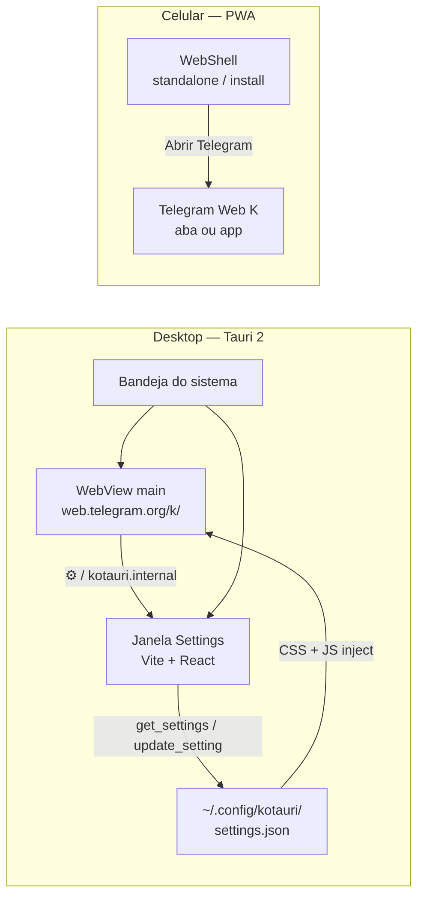

# KoTauri

Cliente desktop leve para Telegram e shell PWA para celular. No desktop, **Tauri 2** embute o **Telegram Web K** (`https://web.telegram.org/k/`) numa WebView nativa, com painel de configurações em React e injeção de CSS/JS na sessão. No celular, o mesmo frontend vira um **PWA instalável** em modo tela cheia, com atalho direto para o Web K.

<p align="center">
  
</p>

<p align="center">
  <a href="https://github.com/clenio77/clenio-kotauri/releases/latest"><strong>Download desktop</strong></a>
  ·
  <a href="https://clenio77.github.io/clenio-kotauri/"><strong>PWA (GitHub Pages)</strong></a>
  ·
  Versão <strong>0.1.3</strong>
</p>

---

## O que é (e o que não é)

| | Desktop (Tauri) | Celular (PWA) |
|---|---|---|
| **Papel** | Wrapper nativo do Telegram Web K | Launcher instalável + atalho para o Web K |
| **Onde roda** | Linux (foco atual), com alvos Windows/macOS no bundle | Navegador / app instalado na tela inicial |
| **Personalização** | Temas, tipografia, compacto, bandeja, downloads nativos | Shell app-like; o chat em si é o Telegram Web |
| **Clipboard / áudio** | Texto via Clipboard API; imagem via bridge GTK (Linux); microfone via WebKit | Depende do navegador e do próprio Telegram Web |

KoTauri **não** é um fork do protocolo MTProto nem um cliente oficial. É um contêiner: a UI de mensagens continua sendo a do Telegram Web K; o valor está no shell (janela, settings, bandeja, downloads, PWA).

---

## Arquitetura



**Dois runtimes, um frontend**

- Com `__TAURI_INTERNALS__` presente → `App.tsx` renderiza o **SettingsPanel** (janela de configurações).
- Sem Tauri (navegador / Pages) → renderiza o **WebShell** (marca, CTA, instalar, auto-open).

A janela principal do desktop **não** carrega o `index.html` do Vite: ela aponta direto para o Telegram Web K. O Vite serve só a UI de settings (e o PWA no web).

---

## Desktop — funcionalidades

### Telegram Web K embutido

- Janela `main` em `https://web.telegram.org/k/`, título `KoTauri — Telegram`, tamanho inicial 1200×800.
- Script de inicialização expõe `window.kotauri.openSettings()`.
- Navegação para `https://kotauri.internal/*` é interceptada no Rust (não sai para a rede):
  - `…/open-settings` → abre a janela de configurações
  - `…/clipboard-image` → lê PNG do clipboard GTK e injeta no Web K

### Painel de configurações

- Janela `settings` (`KoTauri Settings`, 400×600, oculta por padrão).
- Fechar a janela **esconde**, não destrói (CloseRequested prevenido).
- Comandos Tauri: `get_settings`, `update_setting`, `open_settings`, `hide_settings`.
- Alterações persistem em JSON e disparam nova injeção de CSS/JS na WebView principal.

**Como abrir settings**

1. Botão flutuante ⚙ injetado na WebView (`ui_chrome.rs`)
2. Item no menu da bandeja
3. `window.kotauri.openSettings()` (bridge interno)

### Aparência e temas (injeção)

Preferências ativas na UI (`SettingsPanel`):

| Opção | Efeito |
|--------|--------|
| Fonte customizada | CSS na sessão Web K |
| Tamanho da fonte (10–24px) | Tipografia do chat |
| Modo compacto | Densidade de lista/mensagens |
| Bolhas adaptativas | Estilo de balões |
| Altura dos stickers (64–256px) | Stickers / animações |
| Tema | `default`, `midnight`, `nord`, `catppuccin` |
| Mostrar Chat ID | Overlay / indicação de ID |
| Minimizar para bandeja | Fechar → bandeja em vez de sair |
| Iniciar minimizado | Sobe só na bandeja |

Campos legados (`disable_up_edit`, `always_show_scheduled`, forward-*) ainda podem existir no JSON com `#[serde(default)]`, mas **não têm efeito** e foram removidos da UI de propósito.

Há também injeção de barra lateral de pastas estilo Kotatogram e outros ajustes definidos em `settings.rs` / `web_selectors.rs`.

### Clipboard, mídia e downloads

| Capacidade | Como funciona |
|------------|----------------|
| **Colar texto** | `.enable_clipboard_access()` na WebView principal |
| **Colar imagem (Linux)** | Se o paste do browser não trouxer `image/*`, o bridge pede ao Rust; GTK lê o clipboard → PNG → JS cria `File` e dispara paste no Web K (`clipboard_image.rs`) |
| **Microfone / voz** | WebKit: `set_enable_media_stream(true)`, `set_enable_mediasource(true)`, `permission_request` permitido |
| **Downloads** | `on_download` grava na pasta Downloads do sistema; nomes sanitizados e únicos se já existirem (`downloads.rs`) |

> A bridge de imagem PNG via GTK está implementada para **Linux**. Em outros SO o stub devolve `None` até haver backend equivalente.

### Bandeja e janela

- Menu da bandeja: mostrar Telegram, abrir configurações, sair.
- Opção de minimizar para a bandeja ao “fechar”.
- Plugin `tauri-plugin-shell` para abrir URLs no sistema.

### Persistência

Arquivo típico no Linux:

```text
~/.config/kotauri/settings.json
```

Criado na primeira execução com defaults. Serialização via `serde` / `serde_json`.

---

## Celular — PWA app-like

URL de produção: **[clenio77.github.io/clenio-kotauri](https://clenio77.github.io/clenio-kotauri/)**  
Deploy automático em push para `main` / `master` (workflow `pages.yml`, `VITE_BASE_PATH=/clenio-kotauri/`).

### O que o shell oferece

- Marca KoTauri, tagline e CTA **Abrir Telegram** → `https://web.telegram.org/k/`
- **Instalar no celular** quando o Chrome/Edge dispara `beforeinstallprompt`
- Dica de instalação genérica no navegador, ou passos iOS (Compartilhar → Adicionar à Tela de Início)
- Detecção de `display-mode: standalone` / `navigator.standalone`
- Opção **Ao abrir o app instalado, ir direto ao Telegram** (localStorage `kotauri-pwa-auto-open`; countdown ~2s com cancelar)
- Safe-area (`viewport-fit=cover`, `env(safe-area-inset-*)`), theme-color escuro, meta Apple Web App
- Manifest: `display: standalone`, `display_override`, ícones 192/512 (any + maskable), `start_url` com `?source=pwa`
- Service worker via `vite-plugin-pwa` (`registerType: autoUpdate`)

### Como instalar

**Android (Chrome / Edge / Chromium)**

1. Abra a URL do Pages (ou `npm run dev` / preview na rede local).
2. Toque em **Instalar no celular**, ou use o menu do navegador → Instalar app / Adicionar à tela inicial.
3. Abra pelo ícone: modo tela cheia, sem barra do Chrome.

**iPhone / iPad (Safari)**

1. Abra a URL no Safari.
2. Compartilhar → **Adicionar à Tela de Início**.
3. Abra pelo ícone (standalone).

O PWA **não** embute o Telegram numa WebView nativa no celular: ele lança o Web K. A sensação de app vem do standalone + instalação + auto-open.

---

## Stack

| Camada | Tecnologias |
|--------|-------------|
| Shell desktop | Rust, **Tauri 2** (`tray-icon`), **tauri-plugin-shell** |
| WebView Linux | WebKitGTK 4.1, GTK 3 (clipboard imagem, media stream) |
| Frontend | **React 19**, TypeScript ~5.8, **Vite 6** |
| PWA | `vite-plugin-pwa`, Workbox, manifest web |
| Persistência | JSON em `dirs::config_dir()/kotauri/` |
| Testes | Puppeteer + `node:test`, `cargo test`, Clippy |
| CI / Pages | GitHub Actions (`ci.yml`, `pages.yml`) |

Versão alinhada em `package.json`, `src-tauri/Cargo.toml` e `src-tauri/tauri.conf.json`: **0.1.3**.

Identificador do app: `com.kotauri.app`. Binário/pacote desktop: **kotauri** (`/usr/bin/kotauri` no `.deb`).

---

## Pré-requisitos

- **Node.js 20** (como no CI) e npm  
- **Rust** estável (`rustup`) com `cargo` no PATH  
- **Linux** (dev e `.deb`): WebKit/GTK e indicador, por exemplo:

```bash
sudo apt-get install -y \
  libwebkit2gtk-4.1-dev libgtk-3-dev libayatana-appindicator3-dev \
  librsvg2-dev patchelf build-essential curl wget file
```

Runtime do `.deb` declara, entre outras, `libwebkit2gtk-4.1-0` e `libgtk-3-0` (`tauri.conf.json`).

Documentação oficial de pré-requisitos por SO: [Tauri v2](https://v2.tauri.app/).

---

## Desenvolvimento

```bash
git clone https://github.com/clenio77/clenio-kotauri.git
cd clenio-kotauri   # ou clenio-katotagram, conforme o clone local
npm install
npm run tauri dev
```

Sobe o Vite em `http://localhost:1420` (`devUrl` / porta fixa **1420**) e o binário Tauri. A janela principal carrega o Telegram Web K; a de settings usa o frontend local.

### Scripts npm

| Script | Função |
|--------|--------|
| `npm run dev` | Só Vite (frontend / PWA em desenvolvimento) |
| `npm run build` | `tsc` + build de produção → `dist/` |
| `npm run preview` | Preview estático do `dist/` |
| `npm run tauri` | CLI Tauri (`dev`, `build`, …) |
| `npm run test:e2e` | `build` + suíte Puppeteer |
| `npm run test:e2e:run` | Suíte Puppeteer (exige `dist/` já gerado) |

Variáveis úteis:

- `VITE_BASE_PATH` — base do Vite/PWA (Pages usa `/clenio-kotauri/`)
- `TAURI_DEV_HOST` — host HMR quando o frontend é acessado pela rede

---

## Instalar o desktop (release)

1. Baixe o artefato da [release mais recente](https://github.com/clenio77/clenio-kotauri/releases/latest) (ex.: `.deb` em Linux).
2. Instale (exemplo Debian/Ubuntu):

```bash
sudo apt install ./kotauri_0.1.3_amd64.deb
# ou: sudo dpkg -i kotauri_*.deb && sudo apt-get install -f
```

3. Execute `kotauri` (ou pelo menu de aplicativos).

Releases recentes relevantes:

| Versão | Destaque |
|--------|----------|
| **0.1.3** | Engrenagem ⚙, settings honestos (sem toggles mortos), downloads nativos |
| **0.1.2** | Colar imagem via bridge GTK |
| **0.1.1** | Clipboard texto + media stream + suíte Puppeteer |

Atualizar o desktop = baixar/instalar novo pacote. Atualizar o PWA = reopen/refresh na URL do Pages (service worker com auto-update).

---

## Build e empacotamento

```bash
npm run tauri build
```

Fluxo: `beforeBuildCommand` → `npm run build` → artefatos em `src-tauri/target/release/` e pacotes conforme `bundle.targets`.

**Targets configurados:** `deb`, `rpm`, `nsis`, `msi`, `dmg`, `app`.

**AppImage:** há bloco `bundle.linux.appimage`, mas AppImage **não** está na lista `targets`. Para gerar, inclua o alvo explicitamente ou ajuste `tauri.conf.json` antes do build.

O job de CI **não** gera instaladores; isso fica para build local ou job de release.

---

## PWA — local e Pages

```bash
npm install
npm run dev          # http://localhost:1420 — WebShell
# ou
npm run build && npm run preview
```

No celular em rede local, use o IP da máquina (Vite com host adequado) ou o túnel que preferir. Em produção, use o Pages.

O workflow [`.github/workflows/pages.yml`](.github/workflows/pages.yml):

1. `npm ci`
2. `VITE_BASE_PATH=/clenio-kotauri/ npm run build`
3. Publica `dist/` no ambiente GitHub Pages

---

## Testes e CI

### Suíte E2E (Puppeteer)

Runner: `tests/e2e/run.mjs` — sobe `vite preview` + servidor de fixtures e executa:

| Arquivo | Escopo |
|---------|--------|
| `webview-contract.test.mjs` | Contrato estático em `lib.rs`: clipboard, media stream, bridge de imagem, gear, downloads, permissions |
| `web-shell.test.mjs` | Shell sem Tauri: marca, CTA Telegram, instalação / dicas, sem settings panel |
| `settings-panel.test.mjs` | Painel com mock Tauri: compacto, tema, sem toggles legados, `hide_settings` |
| `input-capabilities.test.mjs` | Clipboard API, colar texto/imagem, file input, `getUserMedia` (áudio) |

```bash
npm run test:e2e        # build + testes
npm run test:e2e:run    # só testes (dist/ já existe)
```

### Pipeline CI

[`.github/workflows/ci.yml`](.github/workflows/ci.yml) em push/PR para `main` e `master`:

1. Dependências Linux (Tauri/WebKit + Chromium para Puppeteer)
2. `npm ci` → `npm run build`
3. `npm run test:e2e:run`
4. `cargo clippy` (`-D warnings`) em `src-tauri`
5. `cargo test` em `src-tauri`

Há também testes unitários Rust em módulos como `downloads`, `clipboard_image`, `ui_chrome`, `web_selectors`.

---

## Estrutura do repositório

```text
.
├── src/
│   ├── App.tsx                 # Tauri → SettingsPanel; web → WebShell
│   ├── main.tsx
│   ├── components/
│   │   ├── SettingsPanel.tsx   # UI de preferências (desktop)
│   │   └── WebShell.tsx        # Shell PWA (install, auto-open)
│   └── styles/
│       ├── global.css
│       └── settings.css
├── public/                     # icon.svg, icon-192.png, icon-512.png
├── src-tauri/
│   ├── src/
│   │   ├── lib.rs              # janela main, navigation bridge, setup
│   │   ├── settings.rs         # JSON + geração CSS/JS
│   │   ├── clipboard_image.rs  # GTK → PNG → inject
│   │   ├── downloads.rs        # on_download → pasta Downloads
│   │   ├── ui_chrome.rs        # botão ⚙ flutuante
│   │   ├── web_selectors.rs    # seletores / compat Web K
│   │   └── main.rs
│   ├── tauri.conf.json
│   └── Cargo.toml
├── tests/
│   ├── e2e/                    # Puppeteer + run.mjs
│   ├── fixtures/               # harness de input
│   └── helpers/
├── index.html
├── vite.config.ts              # React + PWA + porta 1420
├── package.json
└── .github/workflows/
    ├── ci.yml
    └── pages.yml
```

A pasta `_reference/` (se existir localmente) está no `.gitignore` — material de consulta opcional, não faz parte do build.

---

## Limitações conscientes

- Personalização profunda (temas, compacto, etc.) aplica-se ao **desktop** via injeção; o PWA é um shell de entrada.
- Colar imagem nativa do sistema via GTK: **Linux**.
- O Telegram Web K pode mudar seletores/DOM; `web_selectors.rs` e avisos de compat existem para isso.
- AppImage e builds multiplataforma precisam de ambiente/alvo adequado; o foco de empacotamento validado no dia a dia é o `.deb` Linux.
- KoTauri depende da disponibilidade e dos termos de uso do Telegram Web.

---

## Nota legal

Este projeto é um **cliente independente** que exibe o **Telegram Web K** dentro de um contêiner desktop (e oferece um atalho PWA no celular). **Não é produto oficial**, não é endossado pelo Telegram e não representa a Telegram Messenger LLP. Marcas e serviços Telegram pertencem aos respectivos titulares. O uso está sujeito aos termos do Telegram e à legislação aplicável.

Licença do repositório: **MIT** (`package.json`).

---

## Autor

**Clenio** — também em `authors` de `src-tauri/Cargo.toml`.

- Repositório: [github.com/clenio77/clenio-kotauri](https://github.com/clenio77/clenio-kotauri)
- Releases: [github.com/clenio77/clenio-kotauri/releases](https://github.com/clenio77/clenio-kotauri/releases)
- PWA: [clenio77.github.io/clenio-kotauri](https://clenio77.github.io/clenio-kotauri/)
